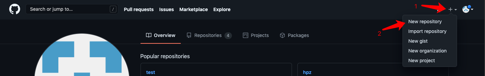
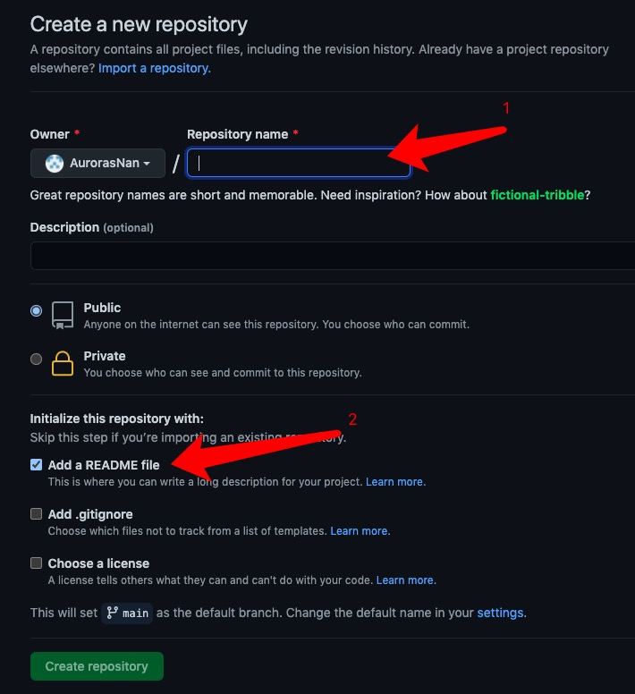
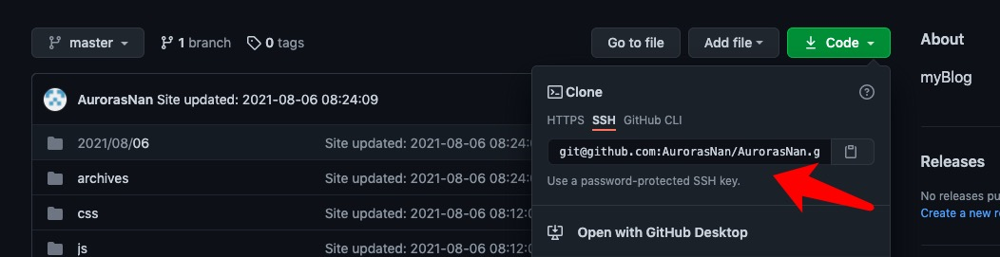

## 前期准备
1.Github账号  
2.安装Node.js  

 ``` 
 $ node -v #若出现版本号说明已安装
 ``` 
3.安装Git  
 
``` bash
 $ git --version #若出现版本号说明已安装
``` 
4.安装Hexo  

<!-- more-->

## 操作步骤

### 创建仓库

仓库的名字必须是username.github.io,其中username为github账户的用户名  

点击Create repositpry创建仓库
### 安装Hexo
- 安装Hexo

``` bash
$ npm install -g hexo-cli
```
- 创建博客目录

``` bash
$ mkdir MyBlog #在任意目录下创建文件夹
$ cd MyBlog #进入文件夹
```
- 初始化目录

``` bash
$ hexo init
```

- 启动本地服务

``` bash
$ hexo s
```
此时通过浏览器访问[localhost:4000](http://localhost:4000)，可看到本地编译效果

### 关联Github

- 编辑MyBlog/_config.yml配置文件，将deploy节点的repo地址修改为仓库地址

``` bash
deploy:
  type: git
  repo: git@github.com:AurorasNan/AurorasNan.github.io.git
  branch: master

```

这种方法适用于配置SSH Key后的，若没有配置，此处使用Https形式的地址
  
- 安装插件

``` bash
$ npm install hexo-deployer-git --save
``` 

- 生成Github博客
``` bash
$ hexo clean && hexo g && hexo d #清楚缓存&&产生静态网页&&部署到Github pages上
``` 

此时通过浏览器访问[username.github.io](http://username.github.io)，可看到你的博客效果

## 博客使用
- 创建新的博客

``` bash
$ hexo new '博客名'
``` 
此时在MyBlog/source/_posts路径下可以看到新创建的.md格式文件

- 使用markdown编辑器编辑文档

- 编辑完成后在本地预览

``` bash
$ hexo clean && hexo g && hexo s
``` 
- 编辑完成后上传Github

``` bash
$ hexo clean && hexo g && hexo d
``` 

## 主题及优化
未完待续...